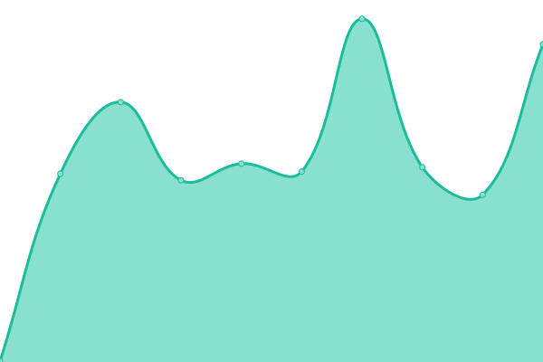
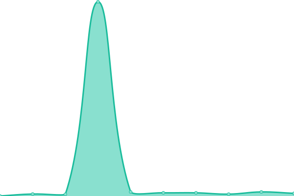

# [📈 Live Status](https://status.xdc.network): <!--live status--> **🟧 Partial outage**

This repository contains the open-source uptime monitor and status page for [XDC.Network](www.xinfin.org), powered by [Upptime](https://github.com/upptime/upptime).

With [Upptime](https://upptime.js.org), you can get your own unlimited and free uptime monitor and status page, powered entirely by a GitHub repository. We use [Issues](https://github.com/xinfinorg/xdc-status-monitor/issues) as incident reports, [Actions](https://github.com/xinfinorg/xdc-status-monitor/actions) as uptime monitors, and [Pages](https://status.xdc.network) for the status page.

<!--start: status pages-->
<!-- This summary is generated by Upptime (https://github.com/upptime/upptime) -->
<!-- Do not edit this manually, your changes will be overwritten -->
<!-- prettier-ignore -->
| URL | Status | History | Response Time | Uptime |
| --- | ------ | ------- | ------------- | ------ |
|  [XDC RPC Endpoint (Mainnet)](https://rpc.xinfin.network) | 🟩 Up | [xdc-rpc-endpoint-mainnet.yml](https://github.com/XinFinOrg/xdc-status-monitor/commits/HEAD/history/xdc-rpc-endpoint-mainnet.yml) | 

 290ms
     
 | 

<a href="https://status.xdc.network/history/xdc-rpc-endpoint-mainnet">87.25%</a>
    

|  [XDC RPC Endpoint By OpenScan.ai](https://rpc.xdcrpc.com) | 🟩 Up | [xdc-rpc-endpoint-by-open-scan-ai.yml](https://github.com/XinFinOrg/xdc-status-monitor/commits/HEAD/history/xdc-rpc-endpoint-by-open-scan-ai.yml) | 

 374ms
     
 | 

<a href="https://status.xdc.network/history/xdc-rpc-endpoint-by-open-scan-ai">99.60%</a>
    

|  [XDC RPC Endpoint By Ankr.com](https://rpc.ankr.com/xdc) | 🟥 Down | [xdc-rpc-endpoint-by-ankr-com.yml](https://github.com/XinFinOrg/xdc-status-monitor/commits/HEAD/history/xdc-rpc-endpoint-by-ankr-com.yml) | 

 403ms
     
 | 

<a href="https://status.xdc.network/history/xdc-rpc-endpoint-by-ankr-com">100.00%</a>
    

|  [XDC RPC Endpoint (Testnet - Apothem)](https://rpc.apothem.network) | 🟩 Up | [xdc-rpc-endpoint-testnet-apothem.yml](https://github.com/XinFinOrg/xdc-status-monitor/commits/HEAD/history/xdc-rpc-endpoint-testnet-apothem.yml) | 

 356ms
     
 | 

<a href="https://status.xdc.network/history/xdc-rpc-endpoint-testnet-apothem">100.00%</a>
    

|  [XDC Apothem RPC Endpoint By Ankr.com](https://rpc.ankr.com/xdc_testnet) | 🟥 Down | [xdc-apothem-rpc-endpoint-by-ankr-com.yml](https://github.com/XinFinOrg/xdc-status-monitor/commits/HEAD/history/xdc-apothem-rpc-endpoint-by-ankr-com.yml) | 

 27ms
     
 | 

<a href="https://status.xdc.network/history/xdc-apothem-rpc-endpoint-by-ankr-com">100.00%</a>
    

|  [XDC Apothem RPC Endpoint By OpenScan.ai](https://apothem.xdcrpc.com) | 🟥 Down | [xdc-apothem-rpc-endpoint-by-open-scan-ai.yml](https://github.com/XinFinOrg/xdc-status-monitor/commits/HEAD/history/xdc-apothem-rpc-endpoint-by-open-scan-ai.yml) | 

 343ms
     
 | 

<a href="https://status.xdc.network/history/xdc-apothem-rpc-endpoint-by-open-scan-ai">0.00%</a>
    

|  [XDCScan Explorer (Mainnet)](https://xdcscan.io) | 🟩 Up | [xdc-scan-explorer-mainnet.yml](https://github.com/XinFinOrg/xdc-status-monitor/commits/HEAD/history/xdc-scan-explorer-mainnet.yml) | 

 453ms
     
 | 

<a href="https://status.xdc.network/history/xdc-scan-explorer-mainnet">100.00%</a>
    

|  [XDCScan Explorer (Testnet)](https://apothem.xdcscan.io) | 🟩 Up | [xdc-scan-explorer-testnet.yml](https://github.com/XinFinOrg/xdc-status-monitor/commits/HEAD/history/xdc-scan-explorer-testnet.yml) | 

 2794ms
     
 | 

<a href="https://status.xdc.network/history/xdc-scan-explorer-testnet">99.68%</a>
    

|  [XDCScan MainNet Explorer (EtherScan)](https://xdcscan.com) | 🟩 Up | [xdc-scan-main-net-explorer-ether-scan.yml](https://github.com/XinFinOrg/xdc-status-monitor/commits/HEAD/history/xdc-scan-main-net-explorer-ether-scan.yml) | 

 351ms
     
 | 

<a href="https://status.xdc.network/history/xdc-scan-main-net-explorer-ether-scan">100.00%</a>
    

|  [XDCScan Apothem Explorer (EtherScan)](https://testnet.xdcscan.com) | 🟩 Up | [xdc-scan-apothem-explorer-ether-scan.yml](https://github.com/XinFinOrg/xdc-status-monitor/commits/HEAD/history/xdc-scan-apothem-explorer-ether-scan.yml) | 

 240ms
     
 | 

<a href="https://status.xdc.network/history/xdc-scan-apothem-explorer-ether-scan">100.00%</a>
    

|  [XDC Faucet (Testnet)](https://faucet.apothem.network) | 🟩 Up | [xdc-faucet-testnet.yml](https://github.com/XinFinOrg/xdc-status-monitor/commits/HEAD/history/xdc-faucet-testnet.yml) | 

 270ms
     
 | 

<a href="https://status.xdc.network/history/xdc-faucet-testnet">100.00%</a>
    

|  [XDC Official Website](https://xinfin.org) | 🟩 Up | [xdc-official-website.yml](https://github.com/XinFinOrg/xdc-status-monitor/commits/HEAD/history/xdc-official-website.yml) | 

 525ms
     
 | 

<a href="https://status.xdc.network/history/xdc-official-website">100.00%</a>
    

|  [XDC Developer Portal](https://xdc.dev) | 🟩 Up | [xdc-developer-portal.yml](https://github.com/XinFinOrg/xdc-status-monitor/commits/HEAD/history/xdc-developer-portal.yml) | 

 1030ms
     
 | 

<a href="https://status.xdc.network/history/xdc-developer-portal">100.00%</a>
    

|  [XDC Forum](https://forum.xinfin.org/) | 🟩 Up | [xdc-forum.yml](https://github.com/XinFinOrg/xdc-status-monitor/commits/HEAD/history/xdc-forum.yml) | 

 447ms
     
 | 

<a href="https://status.xdc.network/history/xdc-forum">100.00%</a>
    

|  [XDC Network GitHub](https://github.com/XinFinOrg) | 🟩 Up | [xdc-network-git-hub.yml](https://github.com/XinFinOrg/xdc-status-monitor/commits/HEAD/history/xdc-network-git-hub.yml) | 

 385ms
     
 | 

<a href="https://status.xdc.network/history/xdc-network-git-hub">100.00%</a>
    

|  [XDC Remix IDE](https://remix.xdc.network) | 🟥 Down | [xdc-remix-ide.yml](https://github.com/XinFinOrg/xdc-status-monitor/commits/HEAD/history/xdc-remix-ide.yml) | 

 2495ms
     
 | 

<a href="https://status.xdc.network/history/xdc-remix-ide">7.43%</a>
    

|  [XDC Web Wallet](https://wallet.xdc.network) | 🟩 Up | [xdc-web-wallet.yml](https://github.com/XinFinOrg/xdc-status-monitor/commits/HEAD/history/xdc-web-wallet.yml) | 

 5698ms
     
 | 

<a href="https://status.xdc.network/history/xdc-web-wallet">99.55%</a>
    

|  [XDC Trade RPC](https://xdctraderpc.xinfin.network) | 🟩 Up | [xdc-trade-rpc.yml](https://github.com/XinFinOrg/xdc-status-monitor/commits/HEAD/history/xdc-trade-rpc.yml) | 

 327ms
     
 | 

<a href="https://status.xdc.network/history/xdc-trade-rpc">100.00%</a>
    

<!--end: status pages-->

[**Visit our status website →**](https://status.xdc.network)

## 📄 License

- Powered by: [Upptime](https://github.com/upptime/upptime)
- Code: [MIT](./LICENSE) © [Anand Chowdhary](https://anandchowdhary.com), supported by [Pabio](https://pabio.com)
- Data in the `./history` directory: [Open Database License](https://opendatacommons.org/licenses/odbl/1-0/)
